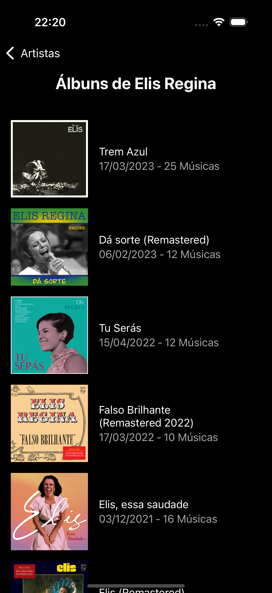
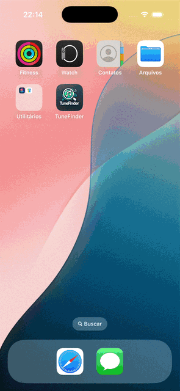

# TuneFinder 🎵

**TuneFinder** é um aplicativo que te oferece uma maneira simples de buscar o seu artista favorito e seus respectivos álbuns, utilizando a API do Spotify para fornecer as informações.

  
  
  
  

## 🚀 Funcionalidades

- **Busca de Artistas**: Encontre artistas e explore seus álbuns e faixas.
- **Visualização de Álbuns**: Veja os álbuns lançados por artistas.

## 📱 Tecnologias Utilizadas

- **Linguagem**: [Swift](https://developer.apple.com/swift/)
- **Framework**: [UIKit](https://developer.apple.com/documentation/uikit/)
- **API**: [Spotify Web API](https://developer.spotify.com/documentation/web-api)

## 🏗️ Arquitetura

A arquitetura utilizada foi a MVVM com algumas classes de suporte: 
- **Repository:** Responsável por intermediar a comunicação entre fontes de dados (API) e a aplicação.
- **Coordinator:** Responsável por administrar a navegação de telas. 
- **Model:** Responsável por definir o modelo de negócio.
- **View:** Responsável pela exibição das telas e elementos visuais como botões, imagens e texto.
- **ViewModel:** Responsável por definir como os dados serão apresentados na visualização.

## 📦 Frameworks

- **Alamofire**: Biblioteca para requisições HTTP de rede.
  - Gerenciador: [CocoaPods](https://cocoapods.org/)
- **Kingfisher**: Biblioteca para download e cache de imagens.
  - Gerenciador: [Swift Package Manager (SPM)](https://swift.org/package-manager/)

## 🎬 Demonstração do App

---
